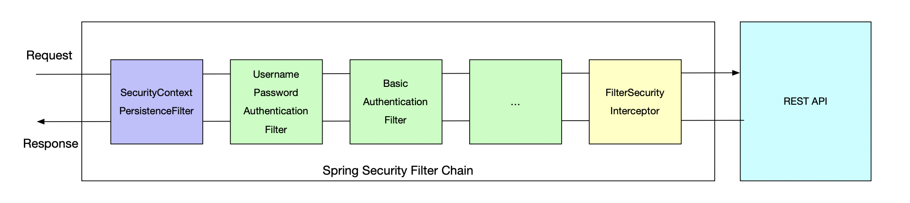

# Spring Security Filter Chain 

## REST API Security 

- The image illustrates the **Spring Security filter chain** used to secure REST APIs.
- Requests go through as series of security filters before reaching the REST API.
- Responses also pass back through the filter chain. 

## Key Filters in the Secuity Chain 

### SecurityContextPersistenceFilter 

- Ensures that the security context (authentication info) is persisted across multiple requests. 
- Loads authentication details from storage (e.g., session, database).

### UsernamePasswordAuthenticationFilter 
- Handles authentication using **usernam** and **password**.
- Extracts credentials from the request and verifies them against a user database. 

### BasicAuthenticationFilter 
- Supports **Basic Authentication (Base64-encoded username/password** in the Authorization header).
- Validates credentials and sets the authentication context. 

### Additional Filters (...)
- Other possible filters can be added, such as JWT authentication, OAuth2, or custom authentication filters. 

### FilterSecurityInterceptor 
- Performs **final authorization checks** before allowing access to the REST API.
- Verifies fi the authenticated user has the necessary permissions(roles) for the requested resource. 

## Final Stage 
- If authentication and authorization succeed, the request reaches the **REST API**.
- Otherwise, appropriate error responses (e.g., 401 Unauthorized or 403 Forbidden) are returned. 

## Key Concept 
- Spring Security Filter Chain acts as a middleware to handle security concerns before processing REST API requests. 

