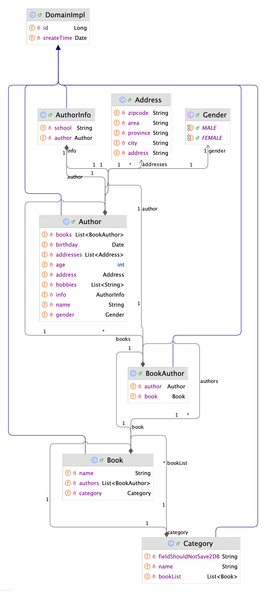
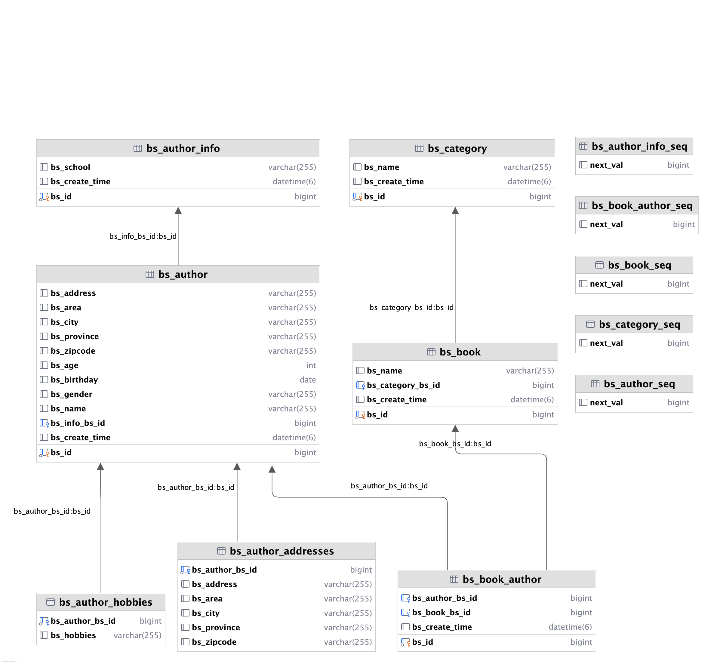

# Design Doc

## Introduction

In bookstore this project we have defined multiple domain entities: Author, AuthorInfo, Book, BookAuthor, Category.

Their E-R Relationships are shown in the following diagrams.


---

### E-R Diagram



### Database Table Diagram 


## Entity Relationships

### Entity Relationship: Author - Address (1:1)

The relationship between **Author** and **Address** is a **composition**, where Address is a value object that belongs
to Author. We use `@Embedded` in Author to include **Address** as part of the same table, and `@Embeddable` in Address
to define it as a reusable value type. This approach avoids extra joins and keeps related data together.

### Entity Relationship: Category - Book (1:N)

In JPS, the best practice for a **one-to-many** relationship without generating an extra join table is manage the
foreign key form the **many-side (Book)** while keeping the **one-side(Category) unaware of relationship**. This avoids
unnecessary complexity and ensures efficient data retrieval.

Setting up a **bidirectional** relationship between `Category` and `Book`.

#### `Category.java`

- **mappedBy='category'** tells JPA that the Category entity's relationship to Book is already defined on the **Book
  side**.
- This means the **category** this field in Book will handle the foreign key(category_id), and JPA will not create a
  middle table or duplicate the relationship on the Category side.
- In other words, it is the **Book(many-side)** owned the relationship and maintain/record the relationship by foreign
  keys.
- Since the relationship is recorded as FK in Book table, Category side can get access to its associated multiple Books
  via this variable(bookList).
- Once we choose to let the many-side(Book) own the relationship with a foreign key in the table, we need to define how
  modifications on the one-side will affect the many-side, and how many-side's modification will be synchronized to the
  one side.
- **OrphanRemoval**: Ues `orphanRemoval=true` in @OneToMany to automatically delete Book entities when they are removed
  from the bookList.
- **Cascade**: Use `cascade=CascadeType.ALL` to propagate operations like PERSIST, MERGE, and REMOVE from Category to
  associated Book entities.

```java
import com.cloud.bookshop.domain.Book;
import jakarta.persistence.CascadeType;
import jakarta.persistence.OneToMany;

@OneToMany(mappedBy = "category", cascade = CascadeType.ALL, orphanRemoval = true)
private List<Book> bookList; 
```

#### `Book.java`

- When adopting `@ManyToOne` annotation here, to enable bidirectional navigation.
- No extra join table(like `category_book`) is created automatically by JPA.
- **Category** does not **own** and **maintain** the relationship, so it doesn't need to track its associated books
  explicitly.

```java
import com.cloud.bookshop.domain.Category;
import jakarta.persistence.FetchType;
import jakarta.persistence.ManyToOne;

@ManyToOne(fetch = FetchType.LAZY, optional = false)
private Category category; 
```

### Entity Relationship: Author: AuthorInfo(1:1)

In a one-to-one relationship, let the most frequently used side (in this case, the Author) manage the relationship.

- **Bidirectional Relationship**:
    - Use `@OneToOne` on both entities to make the relationship bidirectional.
    - On the Author side, the relationship is maintained, so we don't need to use mappedBy here.
- **Owning side**:
    - On the **AuthorInfo** side, we use `@OneToOne(mappedBy="info")` to indicate that `AuthorInfo` is the inverse side,
      and `Author` owns the relationship.
- **Cascade**: Cascade is also supported in OneToOne relationship in JPA.

- `Author.java`

```java
import com.cloud.bookshop.domain.AuthorInfo;
import jakarta.persistence.OneToOne;

@OneToOne
private AuthorInfo info; 
```

- `AuthorInfo.java`

```java
import jakarta.persistence.OneToOne;
// mappedBy means this relationship is handed over to Author side's Author#info this field
@OneToOne(mappedBy = "info")
private Author author; 
```

### Entity Relationship: Author:AuthorHobbies(1:N)

- For a 1:N relationship where `Author` has a list of simple type `String` hobbies, the relationship is stored using
  `@ElementCollection`. This annotation can also be used for other embedded objects.

- When we use `@ElementCollection` with `@CollectionTable`, a foreign key is generated for the relationship between the
  entity and the collection, but it behaves differently compared to a typical `@OneToOne` or `@ManyToOne` relationship.
  - The collection does not create a full entity for each item(like with `@OneToMany`), meaning no separate entity table
    with a foreign key to the collection items themselves.
  - **One-To-Many Behavior**: Though it may seem like a `One-to-Many` relationship(i.e., one Author to many hobbies or
    addresses), it doesn't have the full entity lifecycle associated with `@OneToMany` The collection table is just a
    simple table storing the data, and the FK references the parent entity.

- Author.java

```java
import com.cloud.bookshop.domain.Address;
import jakarta.persistence.ElementCollection;

@ElementCollection
private List<String> hobbies;

// diff from OneToMany, ElementCollection does not have the full entity's lifecycle.
@ElementCollection
private List<Address> addressList; 
```

### Entity Relationship: Author : Book (M:N)

In **many-to-many** relationship between `Author` and `Book`, according to JPA best practices, it is recommended to use
a **join table** to store the relationship, rather than directly using the `@ManyToMany` annotation. This approach not
only enhances the flexibility of the relationship but also allows for better control and the ability to add additional
attributes to the relationship itself.
A **bidirectional** relationship ensures that both entities can navigate th relationship in both directions. For
instance, from a `Book`, we can access the `Author(s)`, and from an `Author`, we can access the `Book(s)` they've
authored. To achieve this, we use this `join table` and specify the `mappedBy` attribute on each side of the
relationship.

- BookAuthor.java

```java
// This entity is created to store the Book & Author mapping relationships
@Data
@Entity
public class BookAuthor extends DomainImpl {

  @ManyToOne
  private Book book;

  @ManyToOne
  private Author author;
}
```

- Author.java

```java

// here the mappedBy 'author' is delegating the relationship management
// to the 'author' field in the BookAuthor entity, which links the Author entity 
// to its associated Book(s) through the join table. 
// Author -> BookAuthor#author 
@OneToMany(mappedBy = "author")
private List<BookAuthor> books;
```

- Book.java

```java
import com.cloud.bookshop.domain.BookAuthor;
import jakarta.persistence.OneToMany;


// here the mappedBy 'book' is delegating the relationship management 
// to the 'book' field in the BookAuthor entity, which links the Book entity to its 
// associated Author(s) through the join table. 
// Book -> BookAuthor#book 
@OneToMany(mappedBy = "book")
private List<BookAuthor> authors; 
```

## Best Practice for JPA Annotations

### Embedded Objects in JPA

- `@Embeddable` for the embedded object class.
- `@Embedded`for embedding the object in the parent entity.
- No lifecycle management, no `cascade` or `orphanRemoval` needed.
- Fetch strategy: N/A (embedded objects are part of the parent entity).

### Simple Type and Embedded Objects in Collections

- `@ElementCollection` for collections for simple type or embedded objects.
- Optionally use `@CollectionTable` for the collection's table.
- No `cascade` or `orphanRemoval`, managed as part of the parent.
- Fetch strategy: **LAZY** by default (as the collection is not a full entity).

### One-To-Many | Many-To-One

- `@ManyToOne` on the "many" side, `@OneToMany` on the "one" side.
- `mappedBy` avoids duplication of relationships. (_note: relationship duplication is different from bidirectional, the
  former one is referring to which side own the relationship, the latter one is referring to "one" side can get "many"
  side, and "many" side can also get access to "one" side_).
- `cascade = CascadeType.ALL` if change should propagate to the "many" side.
- `orphanRemoval = true` for automatic deletion of orphaned entities.
- `optional=false` for required relationship(on `@ManyToOne`).
- Fetch strategy: **LAZY** by default, **EAGER** if needed (e.g., for immediate loading).

### One-To-One

- `@OneToOne` with `@JoinColumn` or `@PrimaryKeyJoinColumn`.
- Use `cascade = CascadeType.ALL` to propagate operations.
- `orphanRemoval = true` for removing orphaned entities when the relationship is broken.
- `optional=false` for mandatory relationships.
- Fetch strategy: **EAGER** by default (for one-to-one relationship), but can be set to **LAZY** if needed.Ò

## Many-To-Many

- Avoid `@ManyoMany` directly; use a **join entity** with `@ManyToOne` on both sides.
- Use `cascade=CascadeType.ALL` to propagate changes across the relationship.
- `orphanRemoval = true` to clean up unlinked relationships in the join entity.
- `optional=false` on `@ManyToOne` for mandatory relationships.
- Fetch strategy: **LAZY* by default for many-to-many (to avoid loading all related entities at once).
